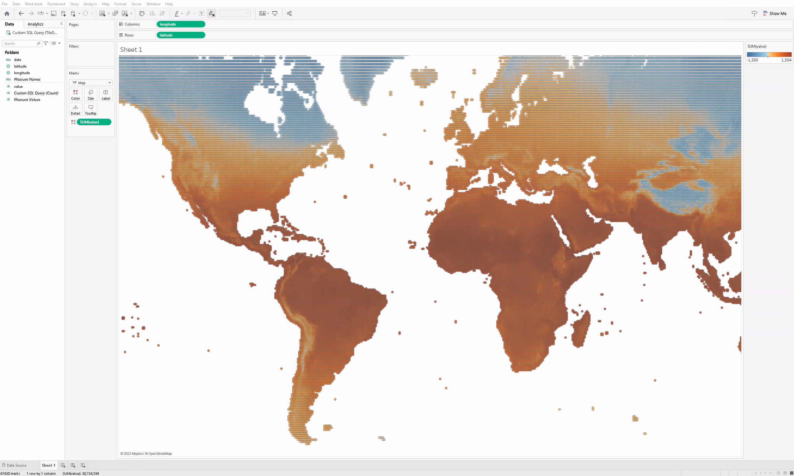
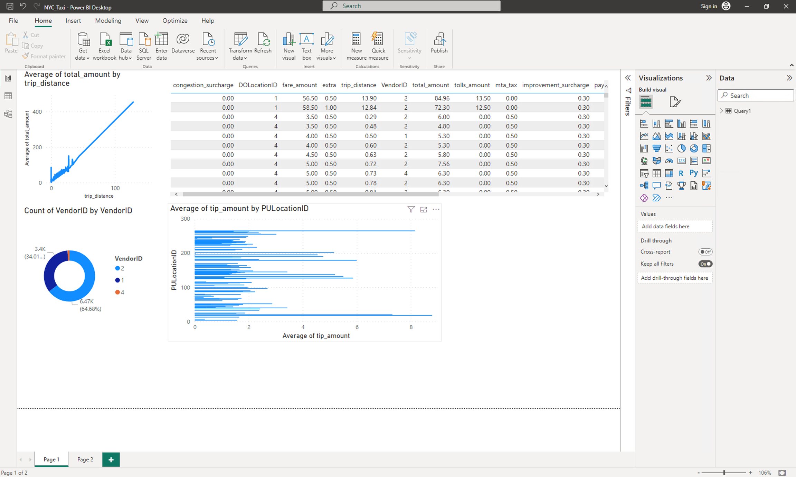
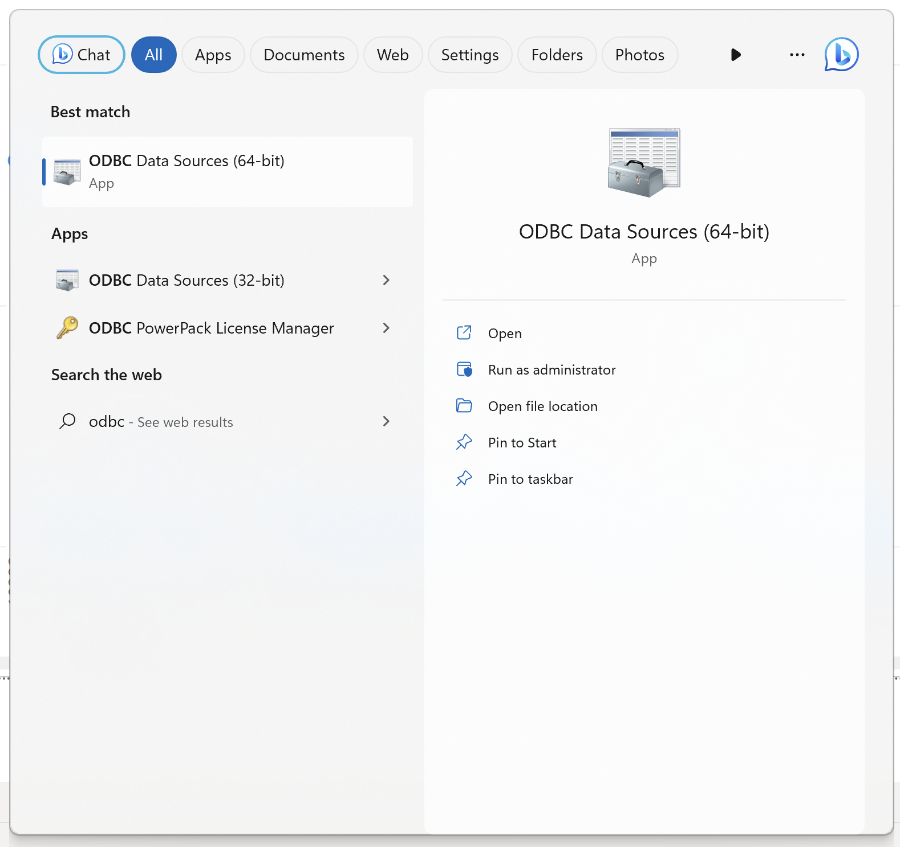
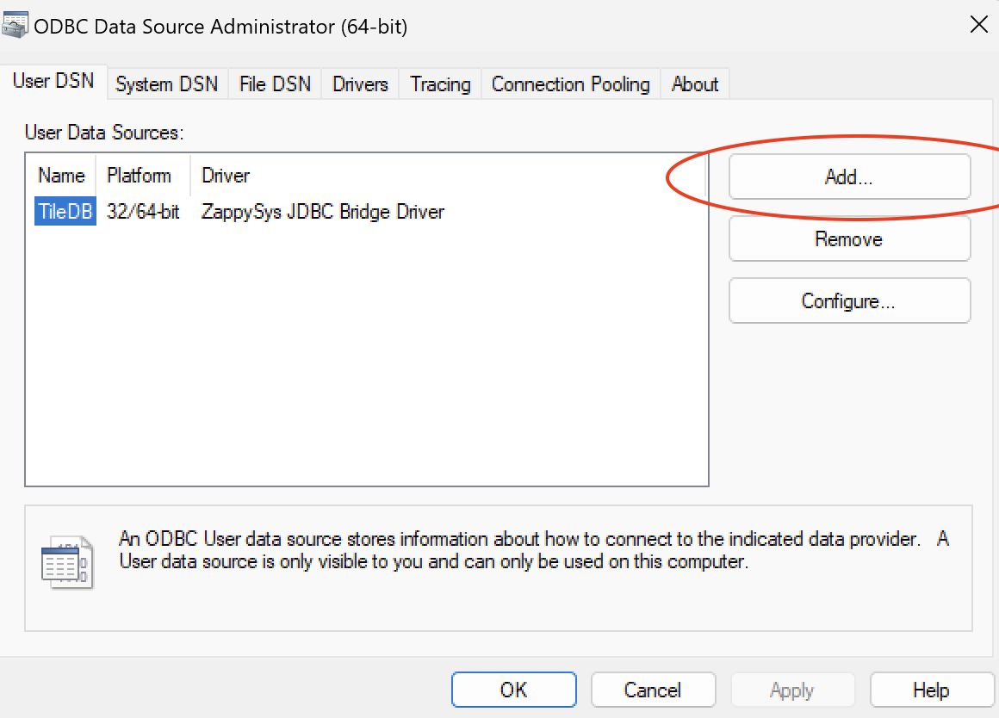
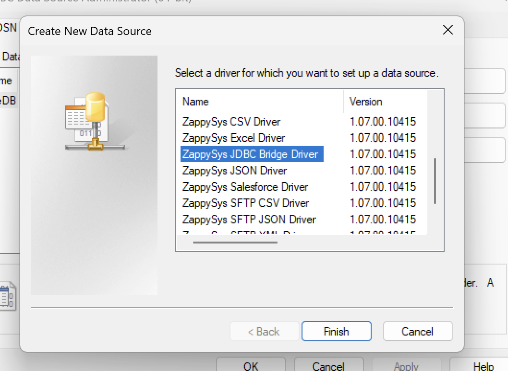

<a href="https://tiledb.com/"></a>

[](https://github.com/TileDB-Inc/TileDB-Cloud-JDBC/actions/workflows/github_actions.yml)

# TileDB-Cloud JDBC Driver

This is a type 4 JDBC driver that allows a Java program to connect to TileDB-Cloud.

## Installation

### Install pre-built package

1. Ensure you have Java Development Kit (JDK) version 11 or later installed on your system.
2. Download the [latest release](https://github.com/TileDB-Inc/TileDB-Cloud-JDBC/releases/latest) of the TileDB-Cloud-JDBC library.
3. Add the `tiledb-cloud-jdbc-x.x.x.jar` file to your project's classpath, replacing `x.x.x` with the version number of the library.

### Build from source

```sh
gh repo clone TileDB-Inc/TileDB-Cloud-JDBC
cd TileDB-Cloud-JDBC
./gradlew assemble
```

## Configuration

The TileDB-Cloud-JDBC library can be configured programmatically in your Java code. The configuration options include:

- `apiKey(String)`: Your TileDB-Cloud API Token. (recommended)
- `username(String)`: Your TileDB-Cloud username
- `password(String)`: Your TileDB-Cloud password
- `rememberMe(boolean)`: Whether the JDBC driver will remeber your login credentials in the future.
- `verifySSL(boolean)`: Whether the JDBC driver will use SSL
- `overwritePrevious(boolean)`: Whether the JDBC driver will overwrite existing credentials. This option can be combined with rememberMe.

Here's an example of configuring the driver where `<NAMESPACE>` is your TileDB namespace:

```java
Properties properties  = new Properties();
properties.setProperty("apiKey", "KEY");
properties.setProperty("rememberMe", "true");

Connection conn = DriverManager.getConnection("jdbc:tiledb-cloud:<NAMESPACE>", properties);
```

You can also include your REST API token in the connection string:

```java
Connection conn = DriverManager.getConnection("jdbc:tiledb-cloud:<NAMESPACE>:<API_TOKEN>", properties);
```

## Usage

### Load driver class

```java
Class.forName("io.tiledb.TileDBCloudDriver")
```

### Run a basic query

```java
Statement stmt = conn.createStatement();
ResultSet rs = stmt.executeQuery("SELECT * FROM `tiledb://TileDB-Inc/quickstart_sparse`");
```

### Handle results

```java
while (rs.next()) {
int rows = resultSet.getInt("rows");
// Process the retrieved values
}
```

## Integration with BI tools

The TileDB-Cloud-JDBC driver provides seamless integration with popular Business Intelligence (BI) tools such as Tableau and Microsoft Power BI. With the driver, you can connect your BI tools directly to TileDB and leverage the powerful visualization and analytics capabilities of these tools.

### Tableau

[Tableau](https://www.tableau.com/) is a leading business intelligence and data visualization tool that allows users to create interactive and insightful visualizations, reports, and dashboards. Together with TileDB, Tableau empowers users to connect, explore, and visualize their data stored in TileDB, enabling seamless integration of advanced analytics and visualization capabilities into their data workflows.



To connect with Tableau, the TileDB-Cloud JDBC driver requires the use of our custom Tableau connector. Tableau has a built-in store for connectors, but this TileDB connector is not currently available for download and needs to be manually placed in the appropriate directory. Visit [TileDB-Inc/TileDB-Tableau-Connector on GitHub](https://github.com/TileDB-Inc/TileDB-Tableau-Connector) for steps on how to configure the Tableau connector.

After you configured the connector, log in to Tableau and select **All TileDB arrays** from the drop-down menu on the top-left corner. You'll be able to see all your owned and shared arrays. You can also add an array to which you have access by using the **Custom SQL Query** option.

### Microsoft Power BI

[Power BI](https://www.microsoft.com/power-platform/products/power-bi/), in conjunction with TileDB, offers a comprehensive business intelligence platform that enables users to connect, transform, and visualize data stored in TileDB. With Power BI's intuitive interface and robust analytics features, organizations can gain valuable insights, create interactive reports and dashboards, and make data-driven decisions effectively.



#### Setup

To use the JDBC driver for PowerBI, you need a JDBC-to-ODBC bridge. We have used and tested the one from [ZappySys](https://zappysys.com/products/odbc-powerpack/). Follow these instructions:

1. Launch the **ODBC Data Sources (64-bit)** application.

   

2. In the **User DSN** tab, select **Add...** to add a new data source.

   

3. Select the **ZappySys JDBC Bridge Driver** option from the list.

   

4. Fill out the connection string details (`jdbc:tiledb-cloud:<NAMESPACE>:<API_TOKEN>`).

   

5. Select **OK** to finish setting up your bridge.

#### Connect

Open Power BI Desktop, and follow these steps:

1. From the **Home** tab, select **Get Data**.
2. Select **More...**, and search for **ODBC** in the data connectors list.
3. Select the **ODBC** option, and select **Connect**.
4. In the ODBC dialog, select the bridged JDBC driver as a data source from the list.
5. By expanding the **Advanced options** section, you can insert a custom SQL query. Otherwise, select **Next**, and Power BI will show you your owned, shared, and public arrays in TileDB.

## Limitations

Query results are limited to 2GBs in size.

## Application compatibility

This driver has been tested against the following applications and tools. Compatibility with other applications is not guaranteed.

- [DBeaver](https://dbeaver.com)
- [Tableau](https://www.tableau.com) (Use with our custom [TileDB-Tableau-Connector](https://github.com/TileDB-Inc/TileDB-Tableau-Connector))
- [Microsoft Power BI](https://powerbi.microsoft.com/) (Use with the ODBC powerpack from [ZappySys](https://zappysys.com))

### Important Notice for Java 17+ Users

When running this project with Java version 17 or higher, it is essential to set the `_JAVA_OPTIONS` environment variable to avoid compatibility issues. Please use the following command:

```sh
export _JAVA_OPTIONS="--add-opens=java.base/java.nio=org.apache.arrow.memory.core,ALL-UNNAMED"
```

For more details, visit Apache Arrow's documentation: https://arrow.apache.org/docs/java/install.html
